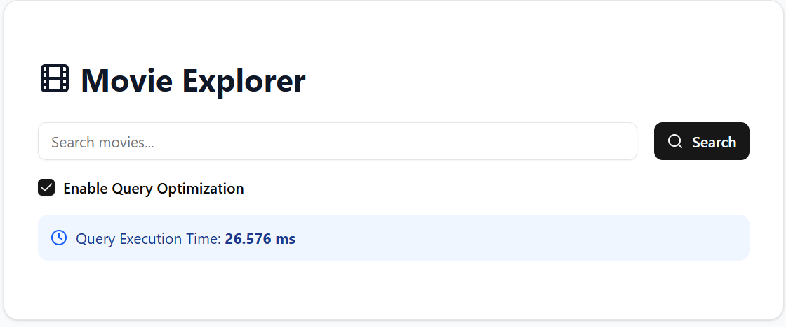
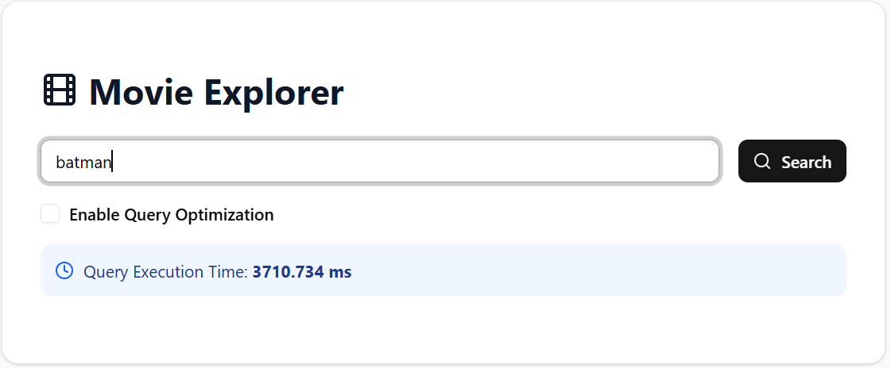
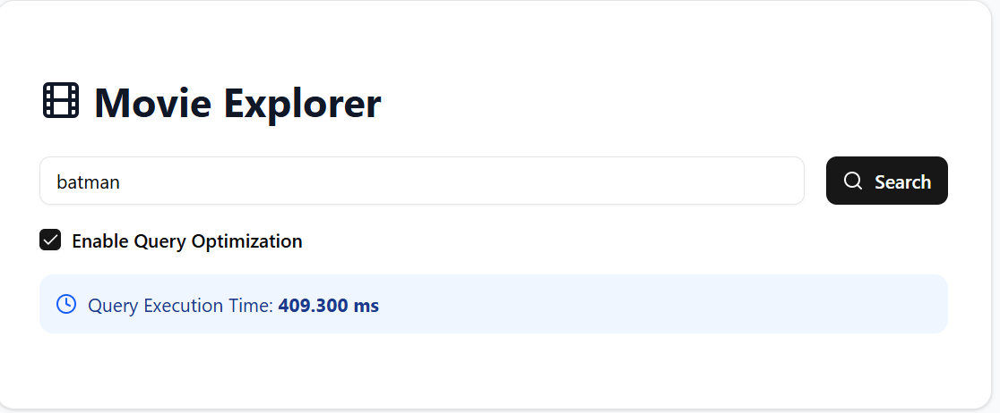
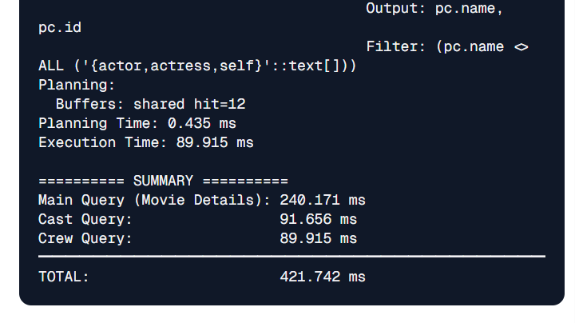
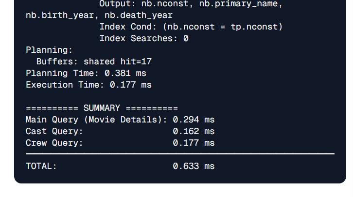

# IMDB Performance Optimization

> Proving that PostgreSQL can handle millions of records with proper optimization - achieving up to **108.22× faster** query performance.

## Demo Link

[https://imdb.rival.my.id/](https://imdb.rival.my.id/)

---

## Background

I've always been curious about the PostgreSQL vs NoSQL performance debate. I also had a frustrating experience working with a colleague whose PostgreSQL queries took up to 30 seconds per request. This made me question: **Is PostgreSQL really slow, or was it just poorly optimized?**

This project aims to prove that PostgreSQL is fast enough to handle millions of records efficiently when properly optimized.

I chose the IMDB dataset for this experiment, using these files:
- name.basics
- title.basics
- title.ratings
- title.principals

### Dataset Size

| Table Name | Number of Rows |
| --- | --- |
| title_type | 10 |
| principal_categories | 13 |
| genres | 28 |
| professions | 46 |
| title_ratings | 470,341 |
| name_basics | 1,000,000 |
| title_principals | 956,348 |
| title_basics | 1,000,000 |
| name_known_for_titles | 2,108,364 |
| title_genres | 1,688,104 |
| name_primary_professions | 1,637,940 |
| **TOTAL** | **8,861,194** |

The full IMDB dataset is much larger, but I limited it to ~8.8 million records for this project.

Full database schema available [here](database/schema.sql).

---

## How It Works

To demonstrate the impact of optimization, I created **two separate database connections**:

1. **Optimized Connection** - Uses indexes and all PostgreSQL optimization features
2. **Unoptimized Connection** - Simulates a poorly configured database

The unoptimized connection disables key performance features:

```go
unoptimizedConfig.AfterConnect = func(ctx context.Context, conn *pgx.Conn) error {
  _, err := conn.Exec(ctx, `
    SET enable_indexscan = OFF;
    SET enable_bitmapscan = OFF;
    SET enable_indexonlyscan = OFF;
  `)
  return err
}
```

Each API endpoint accepts an `optimize` parameter (default: `true`):
- `optimize=true` → Uses the optimized connection
- `optimize=false` → Uses the unoptimized connection
- `/explain` endpoint → Returns the query execution plan

---

## Implementation Details

### `/movies` Endpoint

This endpoint retrieves a list of movies with optional title filtering.

**Query Structure:**
```go
var GET_ALL_QUERY_BASE = `
SELECT tb.tconst, tt.name, tb.primary_title, tb.original_title, 
       tb.is_adult, tb.start_year, tb.end_year, tb.runtime_minutes,
       ARRAY(
           SELECT g.name FROM title_genres tg
           JOIN genres g ON g.id = tg.genre_id
           WHERE tg.tconst = tb.tconst
       ) AS genres,
       tr.average_rating rating,
       tr.num_votes votes
FROM title_basics tb
JOIN title_type tt ON tt.id = tb.title_type_id
LEFT JOIN title_ratings tr ON tr.tconst = tb.tconst`

var GET_ALL_QUERY_FILTER = `
WHERE tb.primary_title ILIKE '%' || $1 || '%'
   OR tb.original_title ILIKE '%' || $1 || '%'`

var GET_ALL_QUERY_LIMIT = `
LIMIT 20`
```

I intentionally used a nested subquery to demonstrate that even "complex" queries can perform well with proper optimization.

### `/movies/:id` Endpoint

This endpoint retrieves detailed information about a specific movie, including cast and crew.

**Query Approach:**
```go
pool.QueryRow(ctx, GET_BY_ID_QUERY, tconst)
// ...
castRows, err := pool.Query(ctx, GET_CAST_QUERY, tconst)
// ...
crewRows, err := pool.Query(ctx, GET_CREW_QUERY, tconst)
```

Instead of using nested subqueries, I split the logic into **three separate queries** within the same connection. This is more efficient because:
- Less work for the database
- Data processing happens in the application layer
- Better control over what data to fetch

---

## Performance Results

### Test Environment

| Machine                          | CPU    | RAM  | Disk   |
| -------------------------------- | ------ | ---- | ------ |
| Oracle Cloud VM (Free Tier, ARM) | 2 Core | 12 GB | 48 GB |


### Benchmark Results

⚠️ **Note:** These results were recorded during my own testing. Performance may differ with multiple concurrent users or when the server is under heavy load.

**Simple explanation:**
- **Unoptimized** = Reading a book page by page to find one word
- **Optimized** = Using the book's index to jump directly to the right page

| Endpoint               | Unoptimized | Optimized  | Latency Reduction | Speedup            |
| ---------------------- | ----------- | ---------- | ----------------- | ------------------ |
| `/movies`              | 2876.061 ms | 26.576 ms  | **99.08%**        | **108.22× faster** |
| `/movies?title=batman` | 3710.734 ms | 409.300 ms | **88.97%**        | **9.07× faster**   |
| `/movies/:id`    | 421.742 ms  | 0.633 ms   | **99.85%**        | **666.28× faster** |

**Screenshots**







---

## Key Learnings

**PostgreSQL is extremely fast** when properly optimized - even with millions of records

**Optimization matters more than the database choice** - a well-optimized PostgreSQL query can outperform poorly designed NoSQL queries

**Indexes are a double-edged sword:**
- Makes reads significantly faster
- Makes writes slightly slower
- Use them wisely based on your read/write ratio

**Query structure impacts performance** - splitting complex queries can sometimes be better than nested subqueries

---

## Tech Stack

- **Backend:** Go (Golang)
- **Database:** PostgreSQL
- **Dataset:** IMDB (8M+ records)
- **Libraries:** pgx (PostgreSQL driver)
